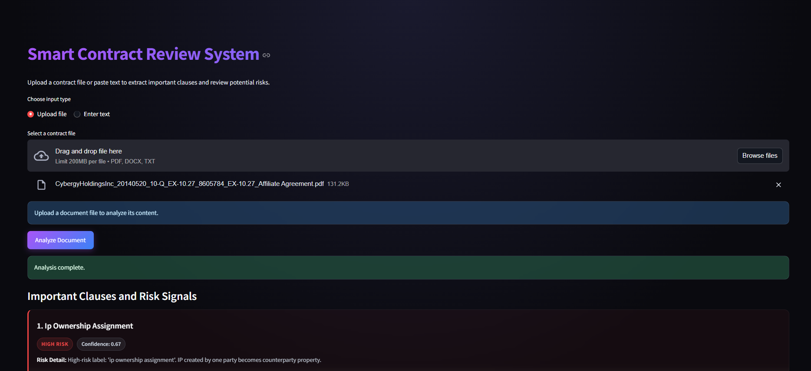

# Smart Contract Review System

A comprehensive Legal AI/NLP pipeline designed to automate the process of analyzing, reviewing, and extracting clauses from legal contracts. The system ingests standard contract files (PDFs, DOCX, TXT), accurately segments them into individual clauses, and classifies each clause using a custom fine-tuned **LegalBERT** model. It flags high-risk and one-sided language while utilizing a RAG (Retrieval-Augmented Generation) infrastructure configured with FAISS for optional rewriting of problematic clauses. 

## Features

- **Document parsing:** Robust text extraction from `.pdf`, `.docx`, and `.txt` files.
- **Clause Segmentation & Classification:** Breaks down contract text and classifies using a LoRA-adapted LegalBERT model.
- **41 Legal Clause Categories:** Trained on the CUAD (Contract Understanding Atticus Dataset) to identify 41 distinct provisions such as 'uncapped liability', 'ip ownership assignment', 'governing law', 'most favored nation', etc.
- **Risk Filtering & Identification:** Programmatic heuristics to flag "High Risk" and "Medium Risk" clauses (e.g., immediate termination, uncapped liability) to protect end-users.
- **RAG-powered Clause Rewriting:** Harnesses sentence-transformers and FAISS (Retrieval-Augmented Generation) to analyze and suggest more neutral or favorable clause rewrites.
- **Modern User Interface:** Fully styled, dark-mode Streamlit dashboard to interactively upload and audit contracts.



## Technology Stack

- **Machine Learning & NLP:** PyTorch, Hugging Face `transformers`, `peft` (LoRA), `sentence-transformers`, `faiss-cpu`, `scikit-learn`
- **Backend Core:** FastAPI, Uvicorn, Python 3.12 
- **Frontend Dashboard:** Streamlit
- **Document Processing:** `pdfplumber`, `python-docx`

## Model Details

The system is powered by a custom LoRA adapter trained on top of `nlpaueb/legal-bert-base-uncased` for multi-class contract clause classification. After 5 epochs of training on the CUAD dataset, the model improved from a 1.9% accuracy baseline to **69.8%** accuracy (Macro F1: 0.650), allowing lightweight but high-quality targeted extraction of contractual language.

## Project Structure

- `app/`: Contains the Streamlit user interface (`streamlit_app.py`).
- `configs/`: Contains JSON mappings such as `label_mapping.json` (41 CUAD labels).
- `src/`: Core backend and Python modules:
  - `api/main.py`: FastAPI server definitions and upload-handling.
  - `extraction/`: Code for parsing and extracting text from complex documents.
  - `inference/`: Clause segmentation and LegalBERT model invocation handling.
  - `risk_filter.py`: System logic to score risk levels on identified clauses.
  - `main_pipeline.py`: Orchestrates extraction, chunking, classification, and filtering.
- `models/legalbert-lora/`: Local configuration and weights for the LoRA adapter.
- `rag/`: Scripts for vector index generation (`build_index.py`), rewriting, and FAISS-based document intelligence.

## How to Run

Before running the application, ensure all dependencies are installed. You will need a modern version of Python (3.10+ recommended).

### 1. Installation

Activate your virtual environment and install the required dependencies:
```bash
pip install -r requirements.txt
```


The project depends on two parts: a FastAPI backend for analysis and a Streamlit frontend for the underlying user interface.

### 2. Environment Setup (RAG Rewriting)

The system utilizes LLaMA-3 (`meta-llama/Meta-Llama-3-8B-Instruct`) via the Hugging Face Inference API to generate rewritten clauses. You must provide a Hugging Face API token.

Create a `.env` file in the root directory:
```env
HF_API_TOKEN=your_huggingface_token_here
```

### 3. Running the Backend (FastAPI)

Open a terminal, activate the environment, and start the FastAPI server:
```bash
python -m uvicorn src.api.main:app --port 8000 --reload
```

### 4. Running the Frontend (Streamlit)

Open a second terminal, activate the environment, and launch the Streamlit app:
```bash
python -m streamlit run app/streamlit_app.py
```
The modern UI will be accessible locally at `http://localhost:8501`. 

## How to Use

1. **Upload or Paste:** Open the Streamlit dashboard and drag-and-drop a contract (PDF, DOCX, TXT) or paste raw text into the input box.
2. **Analysis:** The system will parse the document, chunk it into logical clauses, and run inference using the locally hosted LegalBERT adapter.
3. **Review Risks:** High-risk clauses (e.g., Uncapped Liability) will be flagged in red. You can inspect the clause and (if RAG is configured) view recommended neutral/favorable rewrites.

## Example Output

**Original Clause:**
> "Title to the Technology and all copyrights in Technology shall remain with Company and/or its Affiliates."

- **Clause Type:** IP Ownership Assignment
- **Confidence:** 0.67
- **Risk Level:** <span style="color:red">HIGH</span>

**Rewritten Clause:**
> "Company and/or its Affiliates retain ownership of the Technology and all related copyrights, and grant [Client/Purchaser] a non-exclusive license to use, implement, and distribute the Technology in accordance with the terms of this Agreement."

**What Changed:**
- Language made more concise and clear
- Explicitly grants a non-exclusive license to the other party
- Makes terms mutually beneficial instead of one-sided

## Datasets
- **CUAD** (Contract Understanding Atticus Dataset) by The Atticus Project  
  Used for training the LegalBERT clause classification model.  
  510 contracts, ~13,000 labeled clause spans across 41 clause types.

- **LEDGAR** dataset  
  Used as the retrieval corpus for the RAG rewriting pipeline.  
  Large collection of legal provisions used to retrieve similar clauses 
  and generate improved rewrites.

## Contributors
- K.V. Mokshith Rao
- G. Hamenth  
- K. Anil
